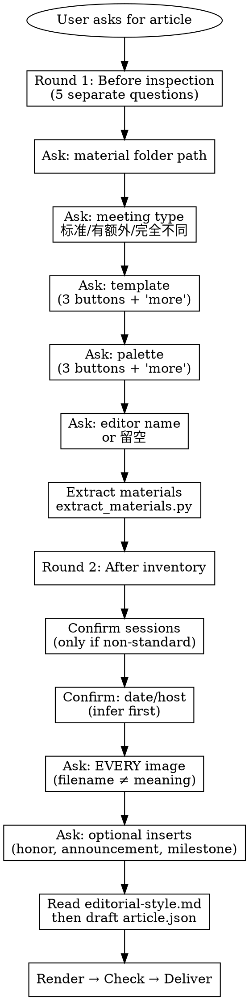

# 公众号读书分享会推文

## 概述

从读书分享会的会议素材（转录稿、英语发言稿、文献 PDF、PPT、会议照片等）生成公众号推文草稿。**核心原则：内容与渲染分离** — 先生成结构化的 `article.json`，再用渲染脚本输出 HTML。

## 快速参考

| 步骤 | 命令 | 说明 |
|------|---------|-------|
| Extract | `python scripts/extract_materials.py <folder> --out extracted_materials` | Scans recursively |
| Notes | `python scripts/prepare_article_notes.py extracted_materials --out article_notes` | Recommended for long materials |
| Write | Agent writes `article.json` directly | Use `write_article_json.py` or `json.dump()` — never hand-write JSON with Chinese quotes |
| Render | `python scripts/render_wechat_article.py article.json --out dist` | Add `--embed-images` for local images |
| Check | `python scripts/check_article_json.py article.json --html dist/article.wechat.html` | **Blocking on any issue** |

## 适用场景

- 组会/读书分享会结束后需要制作公众号推文
- 素材文件夹中有录音转录稿、PPT、文献 PDF、英语发言稿、会议照片等
- 需要把会议内容整理成结构化的微信公众号文章

## 不适用场景

- 只有一份简单会议纪要，没有录音/PPT/PDF 等原始素材
- 需要直接自动发布到微信公众号（本技能只生成草稿，不自动发布）
- 不需要公众号格式，只需要普通 Markdown 笔记

## 信息收集

向用户展示选择项，不要静默应用默认值。**直接向用户询问信息，不要去搜索文件系统来猜测文件夹位置。**

**UI constraint**: `AskUserQuestion` 每题限 4 个选项按钮。超过 4 个时，前 3 个放常用选项，第 4 个放"更多"。用户选"更多"后，用新问题展示剩余选项（格式同第一轮）。**所有 label 必须用中文**，英文名仅用于写入 `article.json` 的值。

**⚠️ 严格遵从：以下选项是精确定义的，必须逐字使用。不要根据技能名称、上下文或其他信息自行编造选项。不允许出现"读书分享会"、"学术绿"等不在下方列表中的选项。**

**Round 1 会议类型**（question: "本次组会是什么类型？", header: "会议类型"，在素材路径之后、模板之前提问）：
1. `{label: "标准流程", description: "英语交流、文献分享、时政交流、自由讨论等常规环节"}`
2. `{label: "有额外环节", description: "在标准流程基础上增加了毕业分享、就业分享、开题报告等"}`
3. `{label: "完全不同的流程", description: "与常规读书分享会完全不一样的安排，我来说明"}`
- 选"标准流程"：使用 `sections`，agent 按标准顺序组织
- 选"有额外环节"：使用 `sessions`，agent 在 Round 2 追问具体新增了哪些环节
- 选"完全不同的流程"：使用 `sessions`，agent 在 Round 2 请用户描述完整环节列表

**Round 1 模板选项**（question: "选择文章模板", header: "模板"）：
1. `{label: "经典简洁", description: "默认简洁风格"}`
2. `{label: "笔记风格", description: "左侧色条+柔和背景"}`
3. `{label: "校园清新", description: "明亮校园风格"}`
4. `{label: "更多模板", description: "还有：编辑排版、报告风格"}`
- 用户选"更多"后，Round 2：question: "选择更多模板", header: "更多模板"
  1. `{label: "编辑排版", description: "更强的开头节奏与编辑版式"}`
  2. `{label: "报告风格", description: "类报告风格，分隔线与编号标签更突出"}`
  3. `{label: "经典简洁", description: "回到默认简洁风格"}`
- label 到 article.json 值的映射：经典简洁=classic, 笔记风格=notebook, 校园清新=campus, 编辑排版=magazine, 报告风格=briefing

**Round 1 配色选项**（question: "选择配色方案", header: "配色"）：
1. `{label: "森林绿", description: "学术绿+柔和米色"}`
2. `{label: "蓝图蓝", description: "蓝色报告色调"}`
3. `{label: "樱花粉", description: "樱花粉+暖白"}`
4. `{label: "更多配色", description: "还有：经典蓝、暖棕绿、灰黑学术、珊瑚暖绿、近单色、深海蓝"}`
- 用户选"更多"后，Round 2：question: "选择更多配色", header: "更多配色"
  1. `{label: "经典蓝", description: "柔和蓝色+暖色注记"}`
  2. `{label: "暖棕绿", description: "克制的棕绿色读书笔记色调"}`
  3. `{label: "灰黑学术", description: "灰黑色学术风格"}`
- Round 3（如果再选"更多"）：question: "更多配色方案", header: "更多配色"
  1. `{label: "珊瑚暖绿", description: "暖珊瑚+绿色，适合清新校园推文"}`
  2. `{label: "近单色", description: "接近单色的极简色调"}`
  3. `{label: "深海蓝", description: "深海蓝+浅青色"}`
- label 到 article.json 值的映射：森林绿=forest, 蓝图蓝=blueprint, 樱花粉=sakura, 经典蓝=classic, 暖棕绿=warm, 灰黑学术=ink, 珊瑚暖绿=sunrise, 近单色=mono, 深海蓝=ocean

**图片处理规则**: 不要尝试自己识别图片内容。**每张图片都必须询问用户**是什么、放在文章什么位置。即使模型支持多模态，也必须问用户确认。

**关键规则**: 不要静默跳过任何决策。不要自行编造选项——必须使用上述定义的选项值。用户不回复某项时，确认默认值。

## 工作流程

1. **Round 1 intake** — 5 个独立问题（素材路径、**会议类型**、模板、配色、编辑）
2. **Extract** — `scripts/extract_materials.py`，递归扫描所有文件类型
3. **Prepare notes** — `scripts/prepare_article_notes.py`，长材料时建立索引
4. **Round 2 intake** — 日期/主持人、图片（每个都要问）、可选插页
5. **Read** `references/editorial-style.md`，然后写 `article.json`
6. **Render** → `check_article_json.py` → 修复 → 重新渲染
7. **Deliver** — 预览 HTML、建议标题/摘要

详细命令和参数见 Quick Reference 表。素材提取细节见 `references/material-extraction.md`。

## 内容规则

- **移动端阅读**：短段落、清晰标题、合理间距
- **会议流程**：导读 → 英语交流 → 文献分享 → [时政交流] → 自由讨论 → 会议小结。空环节省略。
- **非标会议**：Round 1 的"会议类型"问题会提前判断。当用户选择"有额外环节"或"完全不同的流程"时，**必须用 `sessions` 数组替代 `sections`**。`sessions` 中 agent 通过数组位置控制渲染顺序，预定义类型有专用样式，其他 type 走通用渲染（标题→topic→引言→items→小结）。
  - 示例（毕业分享+就业+时政的读书分享会）：`[english_exchange, graduation_sharing, career_sharing, policy_discussion, free_discussion]`
  - 判断标准：如果标准顺序（英语→文献→时政→自由讨论）套不上这次会议的内容，就用 `sessions`
- **英语发言卡片**：每人一张卡片，保留英文原文全文。
- **文献分享**：展开为研究背景、研究问题、方法、发现、讨论价值。区分事实与评论。
- **自由讨论**：必须包含简短的 `intro` 概括话题。条目必须编辑提炼——归纳总结，不粘贴原始转录。不能与文献讨论内容重复。**同一发言人的内容必须合并为一个 item**，不要拆成多张卡片。
- **JSON 写入**：**不要手写 JSON 字符串**。使用 `scripts/write_article_json.py`（写 Python dict 再转 JSON）或 `json.dump()`。手写中文引号必然导致编码错误。
- **图片嵌入**：渲染时使用 `--embed-images`，且 **必须在素材文件夹目录下运行渲染命令**，否则相对路径的图片无法嵌入。
- **转录稿**：是噪声源——需与 PPT/PDF 交叉校验。详见 `references/material-extraction.md`。
- **图片**：不要根据文件名猜测图片内容。每次都必须询问用户。使用 `--embed-images`。
- **`source` 字段**：仅用于溯源，不在正文中显示。
- **公众号署名**: 文章末尾自动添加"本期记录由郑而研资整理"及主持/编辑信息，无需询问。

完整编辑规范见 `references/editorial-style.md`。模板/配色选项见该文件的模板与配色章节。

## 常见借口与反驳

Agent 在压力下会找借口跳过规则。**以下全部是违规行为：**

| 借口 | 现实 |
|------|------|
| "脚手架看起来够好了" | 脚手架是机器组装的，不是编辑撰写的。质检拦住它是有原因的。 |
| "用户说可以跳过重写" | 用户看不到数据层面的缺口。保护他们免受明显有缺陷的交付物。 |
| "质检太严格了" | `_meta.scaffold_generated` 是硬性门槛，不是建议。修复或请用户明确接受风险。 |
| "先发布再迭代" | 先发布再修永远比先审后发更慢更差。 |
| "这是指导不是规则" | 每个例外都觉得自己是特殊的。没有例外。 |
| "文件名很明显是什么图片" | `IMG_20260525_143022.jpg` 可以是任何东西。问用户。 |
| "用户很急，跳过 intake" | 急 = 高效提问，不是少提问。所有门控都是必填的。 |
| "直接写 JSON 更快" | 手写带中文引号的 JSON 必然报错。用 `write_article_json.py` 或 `json.dump()`。 |
| "老师说了两段不同的话" | 同一发言人 → 一张卡片。合并提炼，不要拆分。 |
| "这些选项看起来合理" | 永远不要编造选项。只用本技能定义的值。 |

## 危险信号 — 停下检查

- 交付了 `article.scaffold.json` 而没有重写 → **删除，重写为 `article.json`**
- 因为"文件名很明显"就跳过图片提问 → **回去，每张图片都要问**
- 跳过了 `check_article_json.py` → **立即运行，修复所有问题**
- 没读 `editorial-style.md` 就渲染 → **读完，修改内容，重新渲染**
- 直接引用转录稿而没有交叉校验 → **与 PPT/PDF 校验**
- "用户说急"就跳过门控 → **没有捷径**
- 手写 JSON 带中文引号，反复报错 → **用 `write_article_json.py` 或 `json.dump()`**
- 同一发言人在自由讨论中出现多张卡片 → **合并为一个 item**
- 渲染后图片没有嵌入 → **在素材文件夹目录下运行渲染命令**

## 常见错误

| 错误 | 正确做法 |
|------|----------|
| 把 `article.wechat.html` 源码粘贴到微信 | 打开 `article.preview.html`，选中渲染后的内容，复制富文本 |
| 跳过依赖安装 | 先运行 `pip install python-docx python-pptx pdfplumber pypdf` |
| 交付脚手架 JSON | 必须扩展为完整的 `article.json` |
| 不检查图片就渲染 | 渲染前询问用户每张图片的用途 |
| 跳过质检 | 每次渲染后运行 `check_article_json.py` |
| JSON 字符串中使用中文引号 `""` | 用 Unicode 转义或 `《》` 替代 |
| 正文中出现文件名/路径 | `source` 是私有溯源元数据，不在正文中显示 |

## 资源指南

- `references/input-contract.md` — `article.json` schema
- `references/editorial-style.md` — 编辑规范与内容风格
- `references/material-extraction.md` — 素材提取与 ASR 处理
- `references/wechat-formatting.md` — HTML/SVG 兼容性
- `references/wechat-api.md` — 微信 API（按需使用）
- `references/intake-gate-ui.md` — 提问选项的 UI 约束细节
- `scripts/` — 所有 Python 脚本（提取、笔记、渲染、检查、脚手架、门控、写入）
- `tests/` — 单元测试

## 输出策略

交付物：`article.json`、`article.wechat.html`、`article.preview.html`。仅在用户明确要求时才创建 `source_trace.md`。优先草稿+审核而非直接发布。

## 跨 Agent 可移植性

基于文件、轻工具依赖。任何有能力的 agent 都可以通过读取 `SKILL.md`、生成 `article.json`、用 Python 3 运行渲染器来使用本技能。
