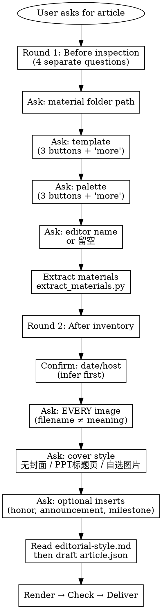

# WeChat Meeting Article

## Overview

Produce a publication-ready WeChat Official Account draft from weekly reading-sharing meeting materials. **Core principle: separate content reasoning from rendering** — generate a structured `article.json` first, then render with the bundled script.

## Quick Reference

| Step | Command | Notes |
|------|---------|-------|
| Extract | `python scripts/extract_materials.py <folder> --out extracted_materials` | Scans recursively |
| Notes | `python scripts/prepare_article_notes.py extracted_materials --out article_notes` | Recommended for long materials |
| Write | Agent writes `article.json` directly | Validate by rendering immediately |
| Render | `python scripts/render_wechat_article.py article.json --out dist` | Add `--embed-images` for local images |
| Check | `python scripts/check_article_json.py article.json --html dist/article.wechat.html` | **Blocking on any issue** |

## When to Use

- 组会/读书分享会结束后需要制作公众号推文
- 素材文件夹中有录音转录稿、PPT、文献 PDF、英语发言稿、会议照片等
- 需要把会议内容整理成结构化的微信公众号文章

## When NOT to Use

- 只有一份简单会议纪要，没有录音/PPT/PDF 等原始素材
- 需要直接自动发布到微信公众号（本技能只生成草稿，不自动发布）
- 不需要公众号格式，只需要普通 Markdown 笔记

## Intake Gate

Present choices to the user instead of silently applying defaults. **Ask the user directly for information; do not search the filesystem to guess folder locations.**

**UI constraint**: `AskUserQuestion` 限 4 个选项按钮。当选项超过 4 个时，常用选项放按钮，全部选项清单写在第 4 个按钮的 `description` 中。详见 `references/intake-gate-ui.md`.

**关键规则**: 不要静默跳过任何决策。用户不回复某项时，确认默认值。

## Workflow

1. **Round 1 intake** — 4 个独立问题（素材路径、模板、配色、编辑）
2. **Extract** — `scripts/extract_materials.py`，递归扫描所有文件类型
3. **Prepare notes** — `scripts/prepare_article_notes.py`，长材料时建立索引
4. **Round 2 intake** — 日期/主持人、图片（每个都要问）、封面、可选插页
5. **Read** `references/editorial-style.md`，然后写 `article.json`
6. **Render** → `check_article_json.py` → 修复 → 重新渲染
7. **Deliver** — 预览 HTML、建议标题/摘要/封面

详细命令和参数见 Quick Reference 表。素材提取细节见 `references/material-extraction.md`。

## Content Rules

- **Mobile reading**: short paragraphs, clear headings, readable spacing
- **Meeting flow**: lead → English exchange → literature → [policy] → discussion → closing. Omit empty sections. For non-standard meetings (e.g., graduation sharing, career talks), use the `sessions` array instead of `sections` — the agent controls ordering and can mix predefined types with custom types. See `references/input-contract.md`.
- **English cards**: one speaker per card, full original text. Use `photo` for portraits.
- **Literature**: expand into background, research question, methods, findings, discussion value. Distinguish facts from comments.
- **Transcripts**: noisy evidence — cross-check against PPT/PDF. See `references/material-extraction.md` for ASR strategies.
- **Images**: never assume what images are from filenames alone. Ask the user every time. Use `--embed-images`.
- **`source` fields**: traceability only — never display in article body.
- **Brand theme**: `"theme": "zhengeryanzi"`（郑而研资）is default, no need to ask.

完整编辑规范见 `references/editorial-style.md`。模板/配色选项见该文件的 Brand Theme 章节。

## Rationalization Table

Agents under pressure will rationalize skipping rules. **These are all violations:**

| Excuse | Reality |
|--------|---------|
| "Scaffold looks good enough" | Scaffold is machine-assembled, not editorially composed. Quality check blocks it for a reason. |
| "The user asked to skip rewriting" | User doesn't see the data-level gaps. Protect them from a visibly flawed deliverable. |
| "Quality check is overly strict" | `_meta.scaffold_generated` is a hard gate, not advice. Fix or get explicit risk acceptance. |
| "I'll save time, iterate later" | Ship-and-fix produces bad articles. Draft-then-review is always faster. |
| "This is guidance, not law" | Every exception feels unique. None are. Follow the gate. |
| "Filename clearly shows what the image is" | `IMG_20260525_143022.jpg` could be anything. Ask. |
| "User is in a hurry, skip intake" | Hurry = ask efficiently, not ask less. All gates are mandatory. |

## Red Flags — STOP and Check

- Delivered `article.scaffold.json` without rewriting → **Delete, rewrite into `article.json`**
- Skipped image questions because "filenames are obvious" → **Go back, ask for every image**
- Skipped `check_article_json.py` → **Run it now, fix all issues**
- Rendered without reading `editorial-style.md` → **Read it, revise content, re-render**
- Used raw transcript quotes without cross-checking → **Verify against PPT/PDF**
- "User said hurry" as reason to skip gates → **No shortcut exists**

## Common Mistakes

| Error | Correct |
|-------|---------|
| Paste `article.wechat.html` source into WeChat | Open `article.preview.html`, select rendered body, copy rich text |
| Skip dependency install | `pip install python-docx python-pptx pdfplumber pypdf` first |
| Deliver scaffold JSON | Must expand into complete `article.json` |
| Render without checking images | Ask user about every image before rendering |
| Skip quality check | Run `check_article_json.py` after every render |
| Chinese quotes `""` in JSON strings | Use Unicode escapes or `《》` |
| Filenames/paths in article body | `source` is private trace metadata only |

## Resource Guide

- `references/input-contract.md` — `article.json` schema
- `references/editorial-style.md` — drafting and content style
- `references/material-extraction.md` — extraction and ASR handling
- `references/wechat-formatting.md` — HTML/SVG compatibility
- `references/wechat-api.md` — WeChat API (only when needed)
- `references/intake-gate-ui.md` — UI constraint details for `AskUserQuestion`
- `scripts/` — all Python scripts (extract, notes, render, check, scaffold, gate, write)
- `tests/` — unit tests (605 lines)

## Output Policy

Deliverables: `article.json`, `article.wechat.html`, `article.preview.html`. Create `source_trace.md` only when explicitly requested. Prefer draft-then-review over direct publishing.

## Cross-Agent Portability

File-based and tool-light. Any capable agent can reuse by reading `SKILL.md`, generating `article.json`, and running the renderer with Python 3.
